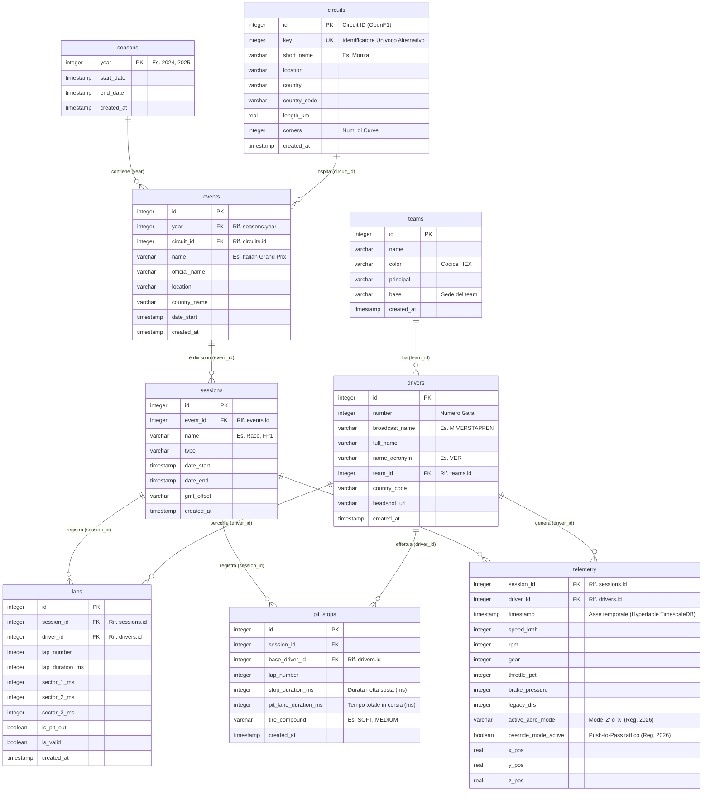

# OpenPaddock - Database Schema (TimescaleDB)

Questo documento contiene lo schema relazionale completo del database di OpenPaddock.
La struttura è stata ideata per TimescaleDB, ottimizzata per l'inserimento multi-stagionale tramite i dati della OpenF1 API e preparata per i nuovi campi telemetrici aerodinamici/elettrici del regolamento 2026.

## Schema Relazionale (ERD)

## Note sull'Implementazione
- **Laps**: Tutti i tempi dei settori e della durata dei giri sono stati tradotti in millisecondi (`integer`) piuttosto che float o stringe, per massimizzare la precisione nei calcoli statistici matematici sul database (evitando problemi ai limiti della virgola mobile o manipolazioni oneroshe sulle stringhe in formato data/ora).
- **Telemetry**: Questa è stata progettata come una tabella pensata all'utilizzo con la funzionalità **Hypertable** di TimescaleDB, partizionata automaticamente per mese d'inserimento o id sessione, per reggere milioni di record creati durante un weekend reale di competizione con query fulminee.  Nasce già predisposta al regolamento [OpenF1 API e FIA 2026](file:///C:/Users/moret/.gemini/antigravity/brain/22b97d67-afff-46c5-b8c6-0ffbc666fc72/openf1_2026_analysis.md).
