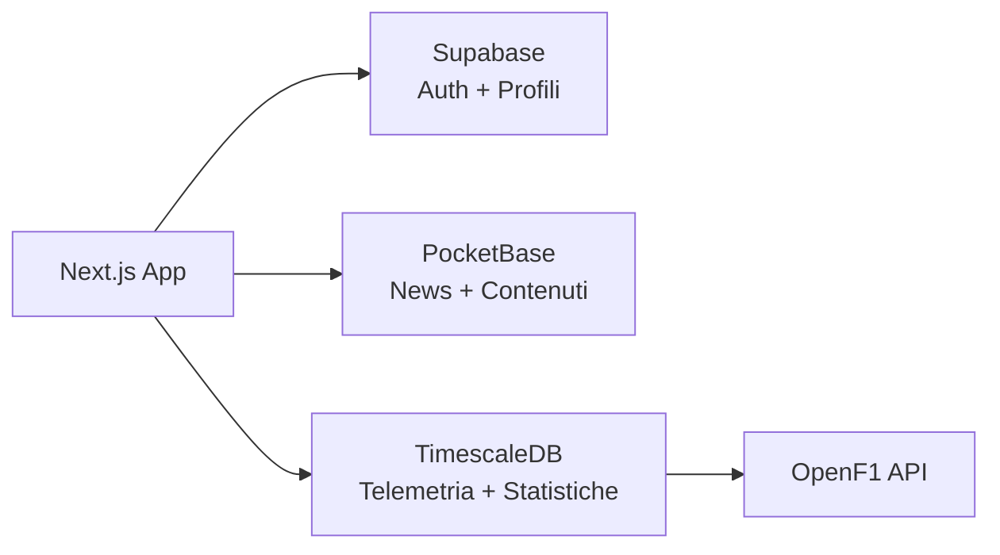

# OpenPaddock — Architettura Completa della Piattaforma

## Visione
Piattaforma pubblica per appassionati di Formula 1: news, live timing, telemetria, statistiche storiche, mappe 3D interattive dei circuiti.

---

## Architettura a 3 Database

| Database | Ruolo | Hosting |
|----------|-------|---------|
| **Supabase** | Autenticazione, profili utente, preferenze, ruoli | Cloud (Supabase.co) |
| **PocketBase** | News, articoli admin, commenti, like, bookmark | Raspberry Pi (Docker) |
| **TimescaleDB** | Telemetria, giri, classifiche, risultati, circuiti | Raspberry Pi (Docker) |

---

## 🟢 MUST HAVE (Necessario Ora)

### 1. Supabase — Auth & Profili

#### `auth.users` (gestita da Supabase)
| Colonna | Tipo | Note |
|---------|------|------|
| id | uuid | PK, auto |
| email | text | Unico |
| encrypted_password | text | Gestito da Supabase |

#### `profiles`
| Colonna | Tipo | Note |
|---------|------|------|
| id | uuid | PK, FK → auth.users.id |
| username | text | Unico |
| display_name | text | |
| avatar_url | text | Nullable |
| country | text | Nullable |
| favorite_driver | int | Numero pilota (es. 1, 44) |
| favorite_team | text | (es. "red_bull", "ferrari") |
| role | enum | `user` / `admin` |
| created_at | timestamp | |

> [!TIP]
> Creiamo un **Database Trigger** su Supabase: quando un utente si registra, viene creata automaticamente una riga in `profiles`.

---

### 2. PocketBase — News & Contenuti

#### `news`
| Campo | Tipo | Note |
|-------|------|------|
| id | auto | PK |
| title | text | |
| link | url | Unico (deduplicazione) |
| description | text | Anteprima (~400 char) |
| content | text | HTML completo |
| image_url | url | Nullable |
| source | text | (es. "motorsport.com") |
| category | text | Sempre "F1" |
| tags | JSON | ["F1", "News"] |
| published_at | datetime | Data originale |
| is_editorial | bool | `true` se scritto da admin |
| author | relation → users | Solo per articoli editoriali |
| created | auto | |

#### `news_interactions`
| Campo | Tipo | Note |
|-------|------|------|
| id | auto | PK |
| news_id | relation → news | |
| user_id | text | UUID Supabase dell'utente |
| type | select | `like` / `bookmark` |
| created | auto | |

#### `comments`
| Campo | Tipo | Note |
|-------|------|------|
| id | auto | PK |
| news_id | relation → news | |
| user_id | text | UUID Supabase |
| username | text | Cache del nome utente |
| content | text | Max 500 char |
| created | auto | |

---

### 3. TimescaleDB — Dati F1 Core

#### `seasons`
| Colonna | Tipo | Note |
|---------|------|------|
| year | int | PK (es. 2024) |
| name | text | "2024 FIA Formula One World Championship" |

#### `circuits`
| Colonna | Tipo | Note |
|---------|------|------|
| id | serial | PK |
| name | text | "Monza" |
| full_name | text | "Autodromo Nazionale di Monza" |
| country | text | |
| city | text | |
| length_km | float | Lunghezza del circuito |
| corners | int | Numero di curve |
| lat | float | Coordinate GPS |
| lng | float | |

#### `drivers`
| Colonna | Tipo | Note |
|---------|------|------|
| number | int | PK (numero pilota) |
| code | text | "VER", "HAM" |
| first_name | text | |
| last_name | text | |
| country | text | Nazionalità |
| team_id | text | FK → teams.id |
| headshot_url | text | Nullable |
| active | bool | Attivo nella stagione corrente |

#### `teams`
| Colonna | Tipo | Note |
|---------|------|------|
| id | text | PK (es. "red_bull") |
| name | text | "Red Bull Racing" |
| color | text | Hex colore team (es. "#3671C6") |
| country | text | |
| logo_url | text | Nullable |

#### `events` (Weekend di Gara)
| Colonna | Tipo | Note |
|---------|------|------|
| id | serial | PK |
| season_year | int | FK → seasons |
| circuit_id | int | FK → circuits |
| round | int | Numero del GP nella stagione |
| name | text | "Gran Premio d'Italia" |
| date_start | date | |
| date_end | date | |

#### `sessions`
| Colonna | Tipo | Note |
|---------|------|------|
| id | serial | PK |
| event_id | int | FK → events |
| type | enum | `FP1` / `FP2` / `FP3` / `Q` / `Sprint` / `Race` |
| date_start | timestamp | |
| date_end | timestamp | Nullable |
| status | enum | `upcoming` / `live` / `completed` |

#### `laps`
| Colonna | Tipo | Note |
|---------|------|------|
| id | uuid | PK |
| session_id | int | FK → sessions |
| driver_number | int | FK → drivers |
| lap_number | int | |
| lap_time | float | Secondi (es. 81.234) |
| sector_1 | float | |
| sector_2 | float | |
| sector_3 | float | |
| compound | text | SOFT / MEDIUM / HARD / INTER / WET |
| tyre_life | int | Giri con quella gomma |
| is_personal_best | bool | |
| date_start | timestamp | |

#### `race_results`
| Colonna | Tipo | Note |
|---------|------|------|
| id | serial | PK |
| session_id | int | FK → sessions (type=Race) |
| driver_number | int | FK → drivers |
| position | int | |
| points | float | |
| grid | int | Posizione in griglia |
| status | text | "Finished" / "DNF" / "DNS" |
| fastest_lap | bool | Ha fatto il giro veloce? |

#### `standings_drivers`
| Colonna | Tipo | Note |
|---------|------|------|
| season_year | int | PK composita |
| driver_number | int | PK composita |
| position | int | |
| points | float | |
| wins | int | |

#### `standings_constructors`
| Colonna | Tipo | Note |
|---------|------|------|
| season_year | int | PK composita |
| team_id | text | PK composita |
| position | int | |
| points | float | |
| wins | int | |

#### `pit_stops`
| Colonna | Tipo | Note |
|---------|------|------|
| id | serial | PK |
| session_id | int | FK → sessions |
| driver_number | int | FK → drivers |
| lap_number | int | |
| duration | float | Secondi (es. 2.4) |
| compound_old | text | Gomma smontata |
| compound_new | text | Gomma montata |

---

## 🟡 NICE TO HAVE (Futuro)

### TimescaleDB — Telemetria Raw

#### `telemetry` ⏱️ (Hypertable TimescaleDB)
| Colonna | Tipo | Note |
|---------|------|------|
| time | timestamp | PK temporale (partizionamento) |
| session_id | int | FK → sessions |
| driver_number | int | |
| speed | int | Km/h |
| rpm | int | |
| throttle | int | 0-100% |
| brake | int | 0-100% |
| gear | int | 1-8 |
| drs | int | 0/10/12/14 |
| x | float | Coordinate posizione |
| y | float | |
| z | float | |

> [!IMPORTANT]
> Questa tabella può generare **milioni di righe per sessione**. È il motivo per cui usiamo TimescaleDB: le hypertable partizionano automaticamente i dati per tempo.

### TimescaleDB — Circuiti 3D

#### `circuit_track_points`
| Colonna | Tipo | Note |
|---------|------|------|
| circuit_id | int | FK → circuits |
| sequence | int | Ordine del punto |
| x | float | Coordinate 3D |
| y | float | |
| z | float | Elevazione |
| sector | int | 1/2/3 |

### Supabase — Personalizzazione

#### `dashboard_preferences`
| Colonna | Tipo | Note |
|---------|------|------|
| user_id | uuid | PK, FK → profiles |
| layout | JSON | Configurazione widget dashboard |
| notifications | JSON | Preferenze notifiche per evento |

#### `user_driver_alerts`
| Colonna | Tipo | Note |
|---------|------|------|
| id | uuid | PK |
| user_id | uuid | FK → profiles |
| driver_number | int | Pilota da monitorare |
| alert_type | text | `overtake` / `pit` / `incident` |

### PocketBase — Interazioni Avanzate

#### `comment_replies` (Thread di commenti)
| Colonna | Tipo | Note |
|---------|------|------|
| id | auto | PK |
| comment_id | relation → comments | Commento genitore |
| user_id | text | |
| content | text | |

---

## Riepilogo Priorità

| Priorità | Area | Cosa |
|----------|------|------|
| 🟢 P0 | Supabase | `profiles` + trigger auto-creazione |
| 🟢 P0 | PocketBase | Migrazione `news` da Supabase a PB |
| 🟢 P0 | TimescaleDB | Tabelle core: `seasons`, `circuits`, `drivers`, `teams`, `events`, `sessions` |
| 🟢 P1 | TimescaleDB | `laps`, `race_results`, `pit_stops` |
| 🟢 P1 | TimescaleDB | `standings_drivers`, `standings_constructors` |
| 🟢 P1 | PocketBase | `news_interactions`, `comments` |
| 🟡 P2 | TimescaleDB | `telemetry` (hypertable) — Live timing |
| 🟡 P2 | TimescaleDB | `circuit_track_points` — Mappe 3D |
| 🟡 P3 | Supabase | `dashboard_preferences`, `user_driver_alerts` |
| 🟡 P3 | PocketBase | `comment_replies` |
